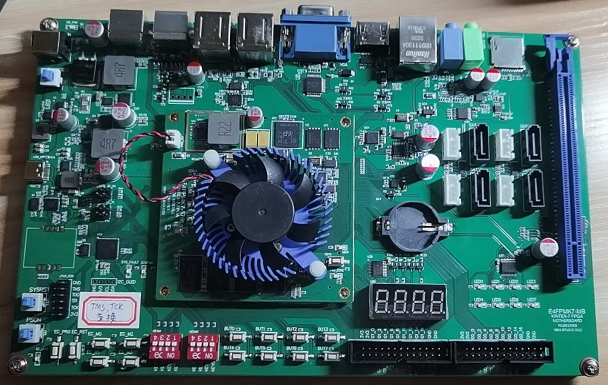
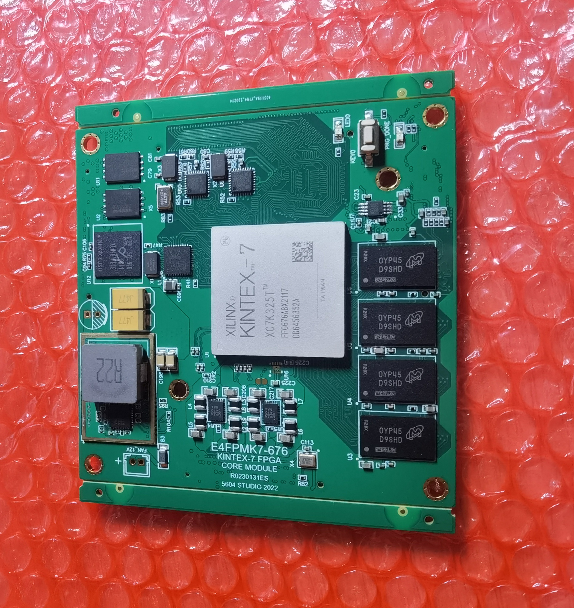

# Lab5604 FPGA开发板系列
## 板卡概览
### E4FPM7K325 MMB （Multi Media Board）多媒体开发板
E4FPM7K325开发板为Lab5604工作室针对音视频应用、软核处理器设计而开发的基于Xilinx 7K325 FPGA的板卡。

SoM的外设资源包含：
|||
|--|--|
|核心	   |XC7K325T-FFG676-2I|
|DDR	   |MT41K256M16-107（D9SHD）*4片，64位模式|
|DDR参考时钟|SG3225VAN-200MHz差分晶振|
|配置Flash|MX25L25645|
|用户Flash|W25Q256|
|用户eMMC	|KLM4G1FETE（三星4G eMMC）|
|核心电源|MP2884+MP86957，50A电流，PMBUS可编程输出电压|
|IO电源|多通道PMIC MP5470，每通道4A电流，PMBUS可编程输出电压|
|以太网PHY|RTL8211|
|USB PHY	|USB3320 * 2|
|时钟源2	|27MHz单端振荡器|
|BTB连接器1|电源、PMBUS、JTAG、PHY IO|
|BTB连接器2  |单端IO|
|BTB连接器3  |GTX IO|
|BTB连接器4  |差分IO|
|PCB	   |10层|

底板的资源包含：
|||
|--|--|
|核心板	|E4FPMK7325-676 SoM|
|视频接口|VGA：24bit DAC，由7123驱动 HDMI：由核心板直推。|
|键鼠接口|PS2 * 2，带电平转换器。|
|以太网接口|RJ45*1|
|USB接口|2*2 USB-A|
|SD卡|SD卡槽*1|
|音频ADDA|24bit I2S ADC和DAC，芯片来自cirrus logic|
|SATA|SATA*4|
|PCIE|PCIE Root插槽*1，时钟发生器PI6C557|
|GT时钟发生器|CDCM61002|
|数码管|4段数码管|
|RTC|RTC|
|开关类IO|按键*8+拨码开关8bit|
|LED|8颗|
|USB-UART|CH343，一路连接到FPGA一路连接到EC|
|板载JTAG|ES版本缺装，需要外接JTAG|
|板载控制器（EC）|STC32G12K128，控制板卡上下电，遥测板卡温度和电源状态，固件完全开源。|
|电源|15~28V输入，转换器为MP38876*2（12V、5V 16A）和MPQ8633（3.3V 12A）|
|ESD防护|所有接口均有ESD防护|
* 注意，以上参数为第一批开发板配置，使用时请区分板卡批次。